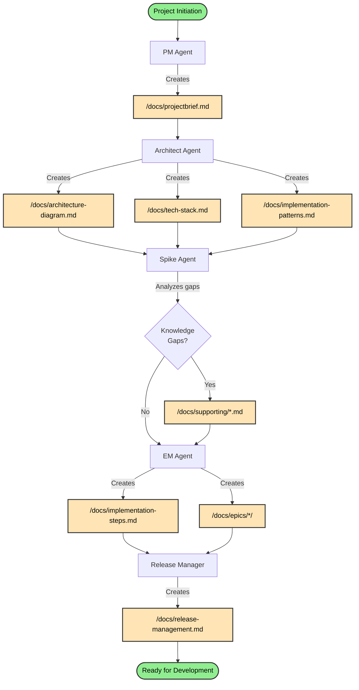
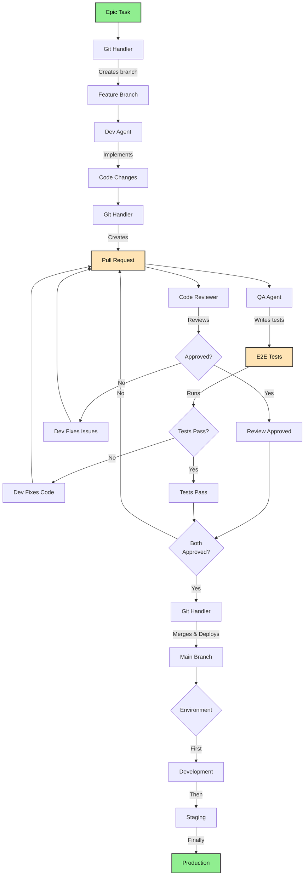

# Agent Workflow Description

This document describes the complete workflow for software development using the specialized agent ecosystem. The process is divided into two main phases: Project Setup and Development Lifecycle.

## Phase 1: Project Setup & Documentation

### Workflow Steps

1. **Project Manager (PM)** - Creates initial project vision
   - Produces: `/docs/projectbrief.md`
   - Captures business requirements and objectives

2. **Architect** - Designs technical solution
   - Produces:
     - `/docs/architecture-diagram.md` - System design visualization
     - `/docs/tech-stack.md` - Technology choices and justifications
     - `/docs/implementation-patterns.md` - Coding standards and patterns

3. **Spike Agent** - Researches technical unknowns
   - Reviews architectural decisions
   - Produces: `/docs/supporting/*.md` - Technical research documents
   - Identifies knowledge gaps requiring investigation

4. **Engineering Manager (EM)** - Plans implementation
   - Produces: `/docs/implementation-steps.md` - Overall project breakdown
   - Creates: `/docs/epics/*/` - Detailed epic breakdowns
   - Identifies pre-implementation requirements

5. **Release Manager** - Defines deployment strategy
   - Produces: `/docs/release-management.md`
   - Determines environment topology (dev/staging/prod)
   - Documents build and deployment processes

### Project Setup Flow Diagram

## Phase 2: Development Lifecycle

### Workflow Steps

1. **Git Handler** - Manages version control
   - Creates feature branches for new work
   - Handles commits with meaningful messages
   - Manages merges after approval

2. **Developer (Dev)** - Implements features
   - Receives task from epic breakdown
   - Implements following architectural patterns
   - Uses Git Handler for version control
   - Creates pull request when complete

3. **Code Reviewer** - Ensures code quality
   - Reviews against architectural standards
   - Checks function duplication
   - Provides feedback for improvements
   - Updates: `/docs/functionmap-codereview.md`

4. **QA Agent** - Validates functionality
   - Writes E2E tests in `/e2etests/`
   - Tests real functionality without mocks
   - Reports pass/fail status

5. **Iteration** - Until all checks pass
   - Dev fixes based on review feedback
   - Dev fixes failing tests
   - Process repeats until approval

6. **Git Handler** - Completes integration and deployment
   - Merges approved branch to main
   - Updates version control
   - Promotes through environments (Dev → Staging → Production)
   - Monitors deployment success

### Development Lifecycle Flow Diagram

## Key Artifacts Produced

### Documentation Phase
- **Project Brief** - Business requirements and goals
- **Architecture Diagram** - System design and components
- **Tech Stack** - Technology choices and rationale
- **Implementation Patterns** - Coding standards and conventions
- **Supporting Docs** - Technical research and best practices
- **Implementation Steps** - Project breakdown and epics
- **Release Management** - Deployment strategy and processes

### Development Phase
- **Feature Branches** - Isolated development work
- **Pull Requests** - Code changes for review
- **Code Reviews** - Quality feedback and improvements
- **E2E Tests** - Automated validation
- **Function Map** - Tracking of all project functions
- **Deployments** - Code promotion through environments

## Agent Collaboration

The agents work together in a coordinated manner:
- Each agent has specific responsibilities and outputs
- Agents consume artifacts from previous stages
- The workflow ensures quality at each step
- Iteration happens within the development cycle until quality standards are met
- Clear handoffs between agents prevent gaps or overlaps

This structured approach ensures consistent, high-quality software delivery from initial concept through to production deployment, with the Git Handler serving as the central coordinator for both version control and deployment operations.