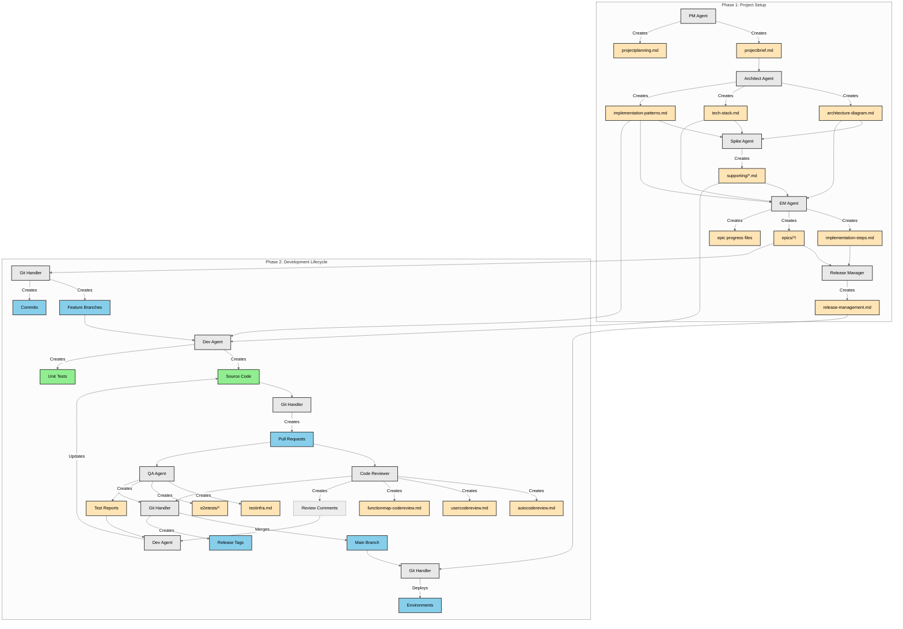

# Agent Artifact Map

This document provides a comprehensive overview of all artifacts created by the agent ecosystem during the software development lifecycle.

## Phase 1: Project Setup & Documentation Artifacts

### PM Agent (Project Manager)
- **`/docs/projectbrief.md`** - Business requirements, objectives, scope definition, target audience, key features (MoSCoW), success metrics, risks, timeline, and resource requirements
- **`/docs/progress/projectplanning.md`** - Master progress tracking checklist for Phase 1 activities

### Architect Agent
- **`/docs/architecture-diagram.md`** - High-level system components, data flow, external integrations, infrastructure boundaries (Mermaid diagrams)
- **`/docs/tech-stack.md`** - Technology choices with justifications, version recommendations, alternatives considered, migration paths
- **`/docs/implementation-patterns.md`** - Naming conventions, interface patterns, code organization, key principles

### Spike Agent (Technical Researcher)
- **`/docs/supporting/spike-*.md`** - Multiple technical research documents covering:
  - Language-specific patterns (e.g., `spike-golang-patterns.md`)
  - Authentication implementations (e.g., `spike-oauth-implementation.md`)
  - Database strategies (e.g., `spike-database-migrations.md`)
  - API design patterns
  - Security best practices
  - Performance optimizations

### EM Agent (Engineering Manager)
- **`/docs/implementation-steps.md`** - Pre-implementation requirements, technical prerequisites, epic roadmap, implementation timeline
- **`/docs/epics/*/`** - Epic-specific folders containing:
  - **`steps-{epicname}.md`** - Detailed breakdown, technical steps, acceptance criteria, testing strategy, rollback plan
  - **`status.md`** - Current progress and blockers
  - **`decisions.md`** - Technical decisions made
  - **`lessons.md`** - Learnings for future epics
- **`/docs/progress/epics/epic-{name}.md`** - Epic-specific progress tracking

### Release Manager
- **`/docs/release-management.md`** - Environment topology (dev/staging/prod), build process, deployment process, promotion workflow, infrastructure details

## Phase 2: Development Lifecycle Artifacts

### Git Handler
- **Feature branches** - Version control branches (e.g., `feature/epic-name`)
- **Commits** - Atomic changes with meaningful messages
- **Pull requests** - Code review and integration requests
- **Tags** - Release version markers (e.g., `v1.0.0`)
- Updates to progress tracking files

### Dev Agent (Developer)
- **Source code files** - Actual implementation in project directories
- **Unit test files** - Test files alongside implementation
- Updates to epic progress tracking

### Code Reviewer
- **`/docs/autocodereview.md`** - Automated review criteria based on architecture
- **`/docs/usercodereview.md`** - User-specific review preferences
- **`/docs/functionmap-codereview.md`** - Comprehensive inventory of all project functions
- **Code review comments** - Feedback on pull requests

### QA Agent
- **`/docs/testinfra.md`** - Test framework selection, environment setup, test architecture, execution strategy
- **`/e2etests/`** - End-to-end test suite containing:
  - **`tests/`** - Test files organized by epic/feature
  - **`fixtures/`** - Test data
  - **`utils/`** - Helper functions and selectors
  - **`config/`** - Test configuration
  - **`reports/`** - Test execution reports
- **Test execution reports** - Pass/fail results with details

## Artifact Flow Diagram

## Artifact Categories

### 1. Documentation Artifacts (Markdown files)
These provide guidance, plans, and tracking:
- Project briefs and requirements
- Architecture and design documents
- Technical research and best practices
- Implementation plans and breakdowns
- Progress tracking files
- Test infrastructure documentation

### 2. Code Artifacts
The actual implementation:
- Source code files
- Unit test files
- End-to-end test suites
- Configuration files

### 3. Version Control Artifacts
Git-related items:
- Feature branches
- Commits with meaningful messages
- Pull requests
- Release tags
- Merge records

### 4. Quality Assurance Artifacts
Review and testing outputs:
- Code review criteria and preferences
- Function inventories
- Test reports and results
- Review comments and feedback

## Artifact Lifecycle

1. **Creation Phase**: Artifacts are created during their respective workflow phases
2. **Usage Phase**: Artifacts are consumed by downstream agents and processes
3. **Update Phase**: Progress tracking and function maps are continuously updated
4. **Archive Phase**: Historical artifacts provide reference for future work

## Key Observations

- **Comprehensive Coverage**: Every phase of development produces trackable artifacts
- **Clear Dependencies**: Artifacts flow logically from one agent to another
- **Progress Visibility**: Multiple tracking mechanisms ensure transparency
- **Quality Focus**: Multiple review and testing artifacts ensure high standards
- **Reusability**: Patterns, spikes, and function maps promote code reuse
- **Traceability**: Git artifacts and progress files maintain full audit trail

This artifact ecosystem ensures that knowledge is captured, shared, and preserved throughout the entire software development lifecycle.
